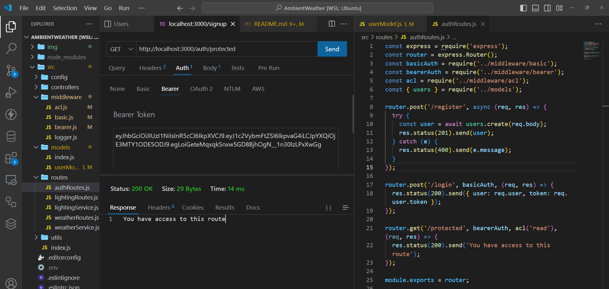

# AmbientWeather App
### Overview
AmbientWeather is a back-end project that integrates real-time weather data with indoor lighting. The application dynamically adjusts lighting based on current weather conditions to create a harmonious and immersive indoor environment.

### Authors: Amanda Marquez, Evan Cheng, and Qilin Xie

- [Jira Board](https://qeambientweather.atlassian.net/jira/software/projects/KAN/boards/1)
- [Team Agreement](https://github.com/QEA-Javascript/server/wiki/Team-Agreement)
- [Pitch idea](https://docs.google.com/document/d/1YEaYmqpfJu-BndbhThsLGw2J7lDyXnWKuzQ3esEsSJo/edit)
- [SoftwareRequirement.md](https://github.com/QEA-Javascript/AmbientWeather/wiki/Software-Requirements-Page)
- [User Stories](https://github.com/QEA-Javascript/AmbientWeather/wiki/User-Stories)
- [UML Wire-frame](https://github.com/QEA-Javascript/AmbientWeather/wiki/UML) : 
- [Domain Modeling](https://github.com/QEA-Javascript/AmbientWeather/wiki/Domain-Modeling-for-AmbientWeather-Project)
- [Database Schema](https://github.com/QEA-Javascript/AmbientWeather/wiki/Database-Schema)

### Features
- **Real-time Weather Integration:** Fetches weather data from a weather API.
- **Dynamic Lighting Adjustment:** Changes indoor lighting settings based on weather conditions.
- **User Customization:** Allows users to set preferences for different weather conditions.
- **Scheduling:** Automates lighting adjustments at specified intervals.

### Tech Stack
- **Backend:** Node.js, Express
- **Weather Data:** Axios for API calls to a weather service
- **Scheduling:** Node Schedule for timed lighting adjustments
- **Communication with Hardware:** Flask server on Raspberry Pi for controlling lights

-----------------------

### Document OAuth Screenshots:
POST with http://localhost:3000/auth/register:

{
    "username": "",
    "password": ""
}

POST with http://localhost:3000/auth/login:

 input auth login

Get with http://localhost:3000/auth/protected:

 input token

## MQTT Integration

This project integrates with an MQTT broker to communicate with a Raspberry Pi.

### Usage

The MQTT client is configured in `src/utils/mqttClient.js`. You can publish messages to MQTT topics using the `publishMessage` function.

### POST /lighting/set-lighting

**Description**: Sets the lighting settings.

**Body Parameters**:
- `color` (string): The color to set.
- `intensity` (number): The intensity level.

**Authorization**: Bearer token and 'write' capability required.
